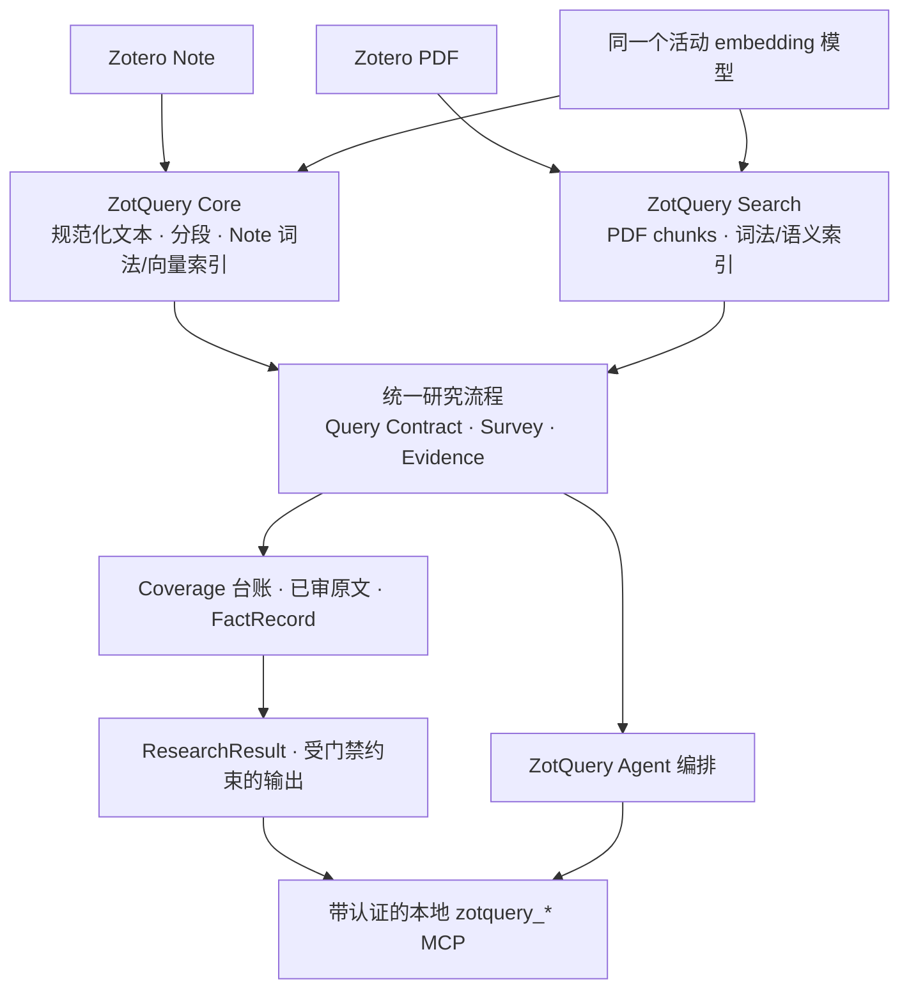

# ZotQuery

[English](README.md) · [架构](docs/ARCHITECTURE-3.0-ZH.md) · [研究协议](docs/RESEARCH-PROTOCOL-ZH.md) · [发布审计](docs/RELEASE-AUDIT-ZH.md)

ZotQuery 是面向 Zotero 10 的本地文献研究插件，重点不是从几个搜索命中直接生成答案，而是让结论能够回到具体原文。它把 PDF 与 Zotero 笔记纳入同一研究流程：发现候选文献、预先界定覆盖范围、阅读和审查原文、记录带类型的事实，再输出区分已核验与尚未完成部分的报告。研究 Agent 也可通过 `zotquery_*` MCP 工具使用这条流程。

**发布状态：**3.0.12 是清理个人数据后的[**公开预发布候选版**](https://github.com/poesein/ZotQuery/releases/tag/v3.0.12)，不是通过实机验收的生产正式版。已有离线回归测试，但尚未完成 Zotero 10 启动、旧版升级、索引及 MCP 的联合实测。打包 ONNX 模型通过 Git LFS 跟踪，克隆源码后需运行 `git lfs pull`。安装前请先看[已知限制](#已知限制与发布状态)和[授权与隐私](#来源授权与隐私)。

## 适合什么研究？为什么使用它？

适合需要回答“哪篇原始文献、哪段原文支持这句话”的任务：比较互相矛盾的研究、核对精确数值或区间、从精读笔记追溯到同一 Zotero 父条目的 PDF、制作可审计的阶段性综述。检索和证据规则是通用的；分发版没有写入某个研究方向或具体科学标识符。

它的代价也要说清楚：索引大型文库需要时间和磁盘空间；宽泛问题可能产生许多需要审查的候选位置；精确事实仍需原始 PDF 文段、稳定位置和人工或 Agent 审阅。扫描版、提取不完整的 PDF 会影响覆盖；向量缓存 100% 也不意味着当前模型服务可用于新查询。ZotQuery 帮助组织和约束研究，不能代替对文献本身的判断。

### 与相近方案的区别

| 方案 | 擅长 | ZotQuery 的增量与边界 |
|---|---|---|
| Zotero 原生检索与人工阅读 | 管理条目、查找文献、阅读原文 | 增加 PDF/笔记联合研究流程、审查状态、类型化事实与覆盖台账；**不替代**研究者判断。 |
| 上游 [ZotSeek](https://github.com/introfini/ZotSeek) | 本地 PDF 语义/混合检索、命中文段预览、只读搜索 MCP | ZotQuery 继承并改造 PDF 检索和 embedding 运行时，再增加原生 Note 索引、持久化 Survey、可写证据会话、Coverage Gate、FactRecord、输出 Profile 和带认证的研究 MCP。这是流程范围的扩展，**不是**检索速度或召回率更优的基准测试结论。 |
| 通用 MCP 客户端或语言模型 | 探索资料、组织文字 | ZotQuery 提供本地来源位置与明确的完成状态；客户端仍须读证据。`ready_for_synthesis` 不自动证明科学解释正确。 |

上游的 PDF 索引、语义搜索和只读 MCP 可见 [ZotSeek 官方 README](https://github.com/introfini/ZotSeek#readme)。这里比较的是有文档依据的工作流程，不是未做过的横向性能测评。

## 设计方案



PDF 和笔记使用**同一个活动向量模型**。Note 向量按文段哈希和模型 ID 缓存，不再为 Note 另起一套推理模型；两类索引仍分别保存，因为 PDF 页码与 Note 行号的来源语义不同。命中只表示“值得去看”。Note 可以帮助导航，但硬事实必须由 PDF 原文支撑。核对笔记中的 claim 时，插件仅检索**同一 Zotero 父条目**下的 PDF，再把找到的 PDF 文段提升为待审证据；不会把 Note 当成 PDF 证据。

| 功能层 | 落实方式 |
|---|---|
| Core | `content/scripts/lne-native.js`、`note-profiles.js`：Note 规范化快照、分段、FTS/向量缓存、模板规则和追溯。 |
| Search | 基于 ZotSeek 的 PDF 索引、混合检索与 embedding 运行时；为 PDF、Note 提供同一活动模型。 |
| Evidence | `content/scripts/research-engine.js`：Query Contract、PDF 候选位置、上下文/审阅台账、FactRecord、冲突处理与终审。 |
| Survey | `content/scripts/lne-tools.js`：持久化计划、候选文献、筛查、审阅和事实。 |
| MCP | 单一本地 `/zotquery/mcp`，公开 43 个 `zotquery_*` 检索/研究/Profile 工具；其中部分会写入本地数据。 |
| Agent/输出 | 统一研究入口与 `content/scripts/output-profiles.js`，只根据已持久化结果渲染，未过门禁的内容不能冒充确定结论。 |

### “全量”和“已核实”的准确含义

先用 `zotquery_evidence_plan` 确定 Query Contract：同一个 MUST 组内为 OR，不同 MUST 组之间为 AND；MUST_NOT 排除；SHOULD 只辅助导航和排序。科学标识符保留 Unicode 字符和原有顺序，不静默把希腊字母降为 ASCII。裸问题自动规划后，仍应检查硬覆盖范围是否符合研究意图。

`QUERY_EXHAUSTIVE` 的“全量”是**穷尽满足硬契约的已索引 PDF chunks**，不是声称找到所有可能文献，也不是读完原始 PDF 每一行。相邻命中可能合并为审查单元，原始位置仍留在台账。列出位置、打开上下文、审查证据、写入 FactRecord 是不同步骤。EXACT 槽需原始 PDF locator、类型匹配的 DIRECT 记录，且值逐字出现在引文中；逐字出现仍需判断语义、单位和实验条件。未解决的 DIRECT 冲突阻断最终合成；零候选不会因“无待审条目”而自动通过。详见[研究协议](docs/RESEARCH-PROTOCOL-ZH.md)与 [Query Contract 说明](docs/QUERY-CONTRACT-V2-ZH.md)。

## 安装与部署

1. 确认 **Zotero 10.0.x**，从 [v3.0.12 预发布页](https://github.com/poesein/ZotQuery/releases/tag/v3.0.12)下载候选 XPI，先读[发布审计](docs/RELEASE-AUDIT-ZH.md)，备份 Zotero 数据目录并正常退出 Zotero。建议先在隔离或已备份的 profile 测试候选包。
2. 从 Zotero 插件管理器安装候选 XPI 并重启。ZotQuery 现使用独立扩展 ID（`zotquery@poesein.github.io`）、偏好、chrome 资源及 SQLite 文件，可与 ZotSeek 并装而不共用可写状态。由于 ID 已更改，3.0.12 **不会原位升级**曾使用 ZotSeek ID 的 ZotQuery 3.0.11 候选包；旧索引和设置保留原状，不会自动复制。请先备份 profile，再重新索引或另行评估迁移；不要手动覆盖扩展文件、数据库或偏好。
3. 打开 **ZotQuery 设置 → 研究系统状态**，比较插件管理器版本与 `/zotquery/health`；分别查看 PDF/Note 索引状态、共享模型一致性和**查询时模型可用性**。若启动失败，保留具体报错，不要清空 Zotero profile。
4. 选择 PDF 的“仅题名与摘要”或“完整 PDF”、文库范围和活动向量模型。要做原文证据核验，必须索引 PDF 原文；只有题名摘要不能提供可靠的 PDF 原文文段。本机 embedding server 是可选方案，使用时须单独启动。先用少量 PDF 与 Note 混合样本验证，再批量索引。
5. 在**笔记索引**中选“我的文库/全部文库”“全部笔记/字面量匹配”及 Note Profile。候选版默认**关闭**笔记变更自动跟踪；准备好后点击“立即同步笔记与向量”。已有用户偏好可能覆盖默认值。`generic` 兜底其他笔记；`strawberry-vnext` 仅兼容旧“精读笔记”格式，不含研究主题。若固定选择 Profile，将优先于自动识别。
6. 在设置中点击**复制 MCP 令牌**，为每个客户端配置 `Authorization: Bearer <令牌>`。不要通过局域网/公网反向代理暴露端口。此研究 MCP 含可写操作，不能等同于上游只读搜索 MCP。

默认 Zotero Local API 端口如下，实际端口以本机设置为准：

```text
GET  http://127.0.0.1:23119/zotquery/health
POST http://127.0.0.1:23119/zotquery/mcp
Authorization: Bearer <令牌>
```

`/zotquery/*` REST 与 MCP 均需令牌。详见[部署验收清单](docs/DEPLOY-3.0-ZH.md)和 [MCP 认证说明](docs/MCP-AUTH-ZH.md)。若恶意本地进程能够读取 Zotero profile，它也可能取得令牌；令牌不能防御这种情况。

公开 XPI 仍是**预发布候选包**，不是通过验收的生产版。开发者也可按[源码构建说明](docs/BUILDING.md)检查 Git LFS 模型哈希并使用白名单打包；构建成功不等于 Zotero 实机验收通过。

## 使用方法

快速找文献可使用 PDF 检索界面或 `zotquery_quick_search`；检查已索引 Note 可使用 `zotquery_lne_*`。这些都是**导航性命中**。需要可审计答案时：

1. 调用 `zotquery_evidence_plan`，检查 MUST/SHOULD、别名、预估规模以及词面是否保留；硬范围太宽时显式收紧。
2. 用 `zotquery_evidence_research_start` 同时建立 PDF Evidence 与持久化 Survey，或用 `zotquery_evidence_sweep` 建立纯 PDF 覆盖会话，保存返回的 `sessionId`。
3. 对 `zotquery_evidence_positions(scope=coverage)` 分页到 `nextOffset=null`；补充导航命中另行查看。统一会话还需持续调用 `zotquery_evidence_promote_notes`，并检查缺失/失败的文献。
4. 对每个门禁审查单元调用 `zotquery_evidence_context`，然后 `zotquery_evidence_review`；仅当文段确实支持问题才标 `supportsQuestion=yes`。EXACT 问题用已审 PDF 原文调用 `zotquery_evidence_fact` 逐槽记录；换算/推断值记为 INFERRED，不得冒充 DIRECT。
5. 若 DIRECT 事实冲突，引用另一处独立 PDF 文段作有来源的裁决。随后查看 `zotquery_evidence_finalize`，读取 `zotquery_research_result`，再用 `zotquery_research_render` 输出。门禁未过时只能生成**阶段性报告**，不能给确定答案。

Output Profile 只改变呈现，不改变检索和 Gate。内置 `compact`、`standard`、`exact`、`exhaustive-vnext`，也可导入经校验的 JSON。Note Profile 是**解析规则**，不是可执行 Markdown 模板；其他笔记模板可通过人工核对过证据角色的自定义 Profile 适配。参见 [Profile 说明](docs/PROFILES-3.0-ZH.md)和[可导入 vNext 输出 JSON](docs/ZotQuery-全量研究输出-vNext.json)。

回链保留真实精度：仅在 PDF 附件唯一且物理页有效时生成页级链接；Note 链接只能选中 Zotero 笔记条目，canonical 行号和短引标明文段，但不会直接跳到 Note 的某一段。

## 已知限制与发布状态

- **尚未实机验收：**离线测试不等于 Zotero 10 启动、旧数据迁移、实时模型查询、PDF/Note 索引及认证 MCP 全部通过。不要把候选版称为生产正式版。
- **原文完整性：**`FULL_TEXT_CANDIDATES` 分页所有**已索引 chunks**；提取截断、缺失页与 OCR 空白仍可能存在。“候选已列尽”不等于“原文全读”。
- **覆盖粒度：**Gate 审查的是硬查询的聚合证据单元，不保证每个 raw hit 单独深读。语义 Top-K 默认是补充召回。Survey 提升失败/缺失文献须在宣称完整前检查。
- **模型可用性：**缓存覆盖率与查询时服务状态是两回事；本地服务停机时，缓存可仍为 100%，但 dense 查询不可用。
- **事实判断：**DIRECT 值须出现在 PDF 引文并有来源；程序仍不能自动判断引文是否在科学语义上真正支持该值，需人工审阅。
- **回链精度：**多个 PDF 附件时不猜测附件，Note 链接停留在条目级。这是来源边界，不是承诺已实现段落级深链。

未完成的发布门禁见[审计](docs/RELEASE-AUDIT-ZH.md)。源码目录可运行 `node tests/regression-final.mjs` 做离线检查，但不能代替实机验收。

## 来源、授权与隐私

ZotQuery 基于 José Fernandes / introfini 的 [ZotSeek](https://github.com/introfini/ZotSeek) 1.21.2 进行整合与改造。ZotSeek 的 PDF 检索、索引、模型选择和 embedding 运行时是 ZotQuery Search 的技术基础；原生 Note 路线、Evidence/Survey、受门禁约束的输出与统一研究 MCP 属于后续整合层。ZotQuery 自身增量使用根目录 [MIT LICENSE](LICENSE)。上游 README 与 `v1.21.2` 包元数据也声明 MIT，但仓库没有 LICENSE 文件；附带的 [ZotSeek MIT 说明](THIRD-PARTY-LICENSES/ZotSeek-MIT.txt)采用 SPDX 标准正文及重建的署名，**不是**从上游复制的原始许可证文件。正式二进制发布前还应向上游确认法律意义上的完整著作权归属。参见[第三方来源说明](THIRD-PARTY-NOTICE.md)。不能把上游“稳定版”或“只读 MCP”的声明直接套到本候选包。

已补入[模型与运行时的许可证正文](THIRD-PARTY-NOTICE.md)。公开正式分发前仍须核实 ZotSeek 上游完整著作权人名单，并逐一匹配打包 WASM/压缩运行时资产的具体来源版本。根目录 MIT 许可证不覆盖第三方另有的授权义务。

候选分发包不含个人研究方向、密钥、PDF/Note 索引、Survey 数据库、日志或 Zotero 用户 profile。`strawberry-vnext` 只透露旧笔记**格式**，不含研究主题。本地偏好、模型凭据、索引和会话保留在用户的 Zotero 数据目录；升级不会主动清除。勿上传完整 profile 或未脱敏日志。反馈问题请提供版本、复现步骤及脱敏错误。
