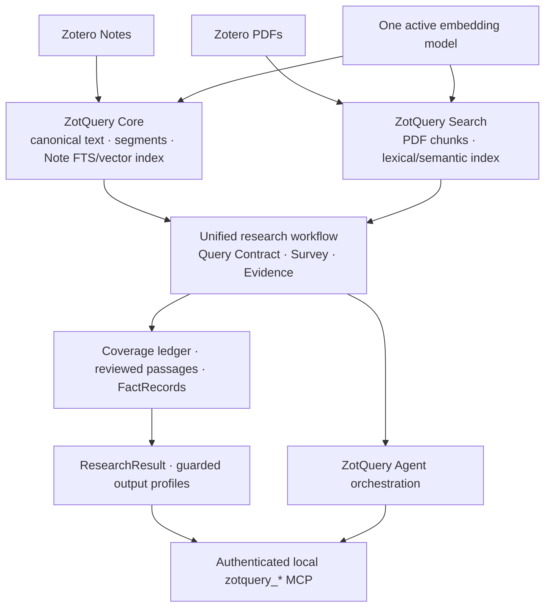

# ZotQuery

[简体中文](README-ZH.md) · [Architecture](docs/ARCHITECTURE-3.0-ZH.md) · [Research protocol](docs/RESEARCH-PROTOCOL-ZH.md) · [Release audit](docs/RELEASE-AUDIT-ZH.md)

ZotQuery is a Zotero 10 plugin for *research with traceable evidence*, not a chatbot that answers from a few search hits. It joins indexed PDFs and Zotero notes in one local workflow: discover candidate works, define what must be covered, inspect source passages, record typed facts, and render a report that distinguishes verified findings from unfinished work. An agent can use the same workflow through `zotquery_*` MCP tools.

**Release status:** 3.0.11 is a privacy-sanitized [**public pre-release candidate**](https://github.com/poesein/ZotQuery/releases/tag/v3.0.11), not an accepted production release. Offline regression tests are available, but this candidate has not passed live Zotero 10 startup, upgrade, indexing, and MCP acceptance tests. The bundled ONNX model is tracked with Git LFS; `git lfs pull` is needed after cloning the source. Read the [known limitations](#limitations-and-release-status) and [redistribution checks](#attribution-licenses-and-privacy) before installing.

## Why use it?

ZotQuery is aimed at literature-intensive questions where a useful answer must show *which original passage supports which claim*. Examples include comparing conflicting reports, auditing exact values or ranges, following a claim from a reading note back to its parent paper, and producing a staged literature review without silently treating a search result as a read document. Its query and evidence policy is domain-independent; no particular research topic or scientific identifier is built into the distributed Note Profile.

The practical trade-off is deliberate: the plugin helps find and organize evidence, but a defensible answer still requires context reading and human or agent review. Large libraries take time and disk space to index. Broad queries can yield many review units. Exact facts need original PDF passages and stable locators. Scanned or incompletely extracted PDFs remain a limitation, and a full vector cache does not guarantee that the active embedding service is reachable.

### How it differs from adjacent tools

| Workflow | Good at | What ZotQuery adds / does not claim |
|---|---|---|
| Zotero's ordinary search and manual reading | Finding items and reading originals in Zotero | A shared PDF/Note research workflow, recorded review states, typed facts, and a coverage ledger. It does **not** replace manual source judgment. |
| [ZotSeek](https://github.com/introfini/ZotSeek), the upstream project | Local PDF semantic/hybrid retrieval, passage previews, and a read-only search MCP | ZotQuery builds on its PDF search and embedding runtime, then adds a native Note index, persistent Survey, writable evidence sessions, Coverage Gate, FactRecords, output profiles, and an authenticated research MCP. This is a broader workflow, not a measured claim of better ranking speed or recall. |
| A general-purpose MCP client or LLM | Exploring and drafting from retrieved material | ZotQuery supplies local source positions and explicit completion states. The client still must inspect the evidence; `ready_for_synthesis` is not automatic proof that an interpretation is correct. |

The [upstream ZotSeek README](https://github.com/introfini/ZotSeek#readme) describes its PDF indexing, semantic search, and read-only MCP. The table compares documented workflows, not head-to-head benchmark results.

## Design at a glance



The PDF and Note paths share **one active embedding model**. Note vectors are cached by segment text hash and model ID; switching models does not turn the Note path into a separate inference stack. The indexes remain distinct because PDF and Note locators mean different things. Search hits are candidates. A Note can guide a search, but a hard original-source fact requires a PDF passage. When a Note claim is verified, ZotQuery searches PDFs attached to the **same Zotero parent item** and promotes located passages for review; it does not turn the Note into PDF evidence.

| Area | Implementation and responsibility |
|---|---|
| Core | `content/scripts/lne-native.js`, `note-profiles.js`: canonical Note snapshots, segments, Note FTS/vector cache, profile-based parsing and tracing. |
| Search | ZotSeek-derived PDF index, hybrid search, and embedding runtime; supplies the same active model to PDF and Note indexing. |
| Evidence | `content/scripts/research-engine.js`: Query Contract, indexed PDF positions, context/review ledger, typed FactRecords, conflict resolution and finalization. |
| Survey | `content/scripts/lne-tools.js`: persistent plans, candidate works, screening, reviews and facts. |
| MCP | One authenticated local endpoint, `/zotquery/mcp`, exposing 43 `zotquery_*` research/search/profile tools; some tools write local state. |
| Agent/output | Unified research entry point and `content/scripts/output-profiles.js` render persisted results without promoting blocked findings to definitive claims. |

### What “complete” means here

`zotquery_evidence_plan` defines a hard Query Contract before a sweep: alternatives **within** a MUST group are OR; separate MUST groups are AND; MUST_NOT excludes; SHOULD helps navigation and ranking. Literal scientific identifiers retain Unicode characters and order—no silent Greek-to-ASCII aliasing. Automatically planned questions should be inspected before treating their coverage universe as final.

`QUERY_EXHAUSTIVE` covers indexed PDF chunks matching that contract, not every possible paper or every line of every original PDF. Adjacent hits may be clustered into review units; raw positions stay in the audit ledger. Listing a position, opening context, reviewing it, and recording a FactRecord are separate actions. An EXACT slot needs a typed DIRECT record with an original PDF locator and a value literally present in its cited quote. A literal match still needs semantic and methodological judgment. Unresolved direct-fact conflicts remain blocking. A zero-candidate session cannot pass the gate simply because there is nothing to review. See the [protocol](docs/RESEARCH-PROTOCOL-ZH.md) and [Query Contract guide](docs/QUERY-CONTRACT-V2-ZH.md).

## How to install and deploy

1. Confirm **Zotero 10.0.x**, download the candidate XPI from the [v3.0.11 pre-release](https://github.com/poesein/ZotQuery/releases/tag/v3.0.11), and review the [release audit](docs/RELEASE-AUDIT-ZH.md). Back up the Zotero data directory and close Zotero before an upgrade. Test the candidate first in a separate or backed-up profile.
2. Install the candidate XPI through Zotero's plugin manager and restart. Do not manually replace extension files, SQLite databases, or preferences. The historical extension ID `zotseek@zotero.org` and some internal preference/database names are retained **only for migration compatibility**; the product and public API are ZotQuery.
3. Open **ZotQuery Settings → Research system status**. Compare the plugin-manager version with `/zotquery/health`; inspect PDF/Note index state, shared-model consistency, and **live query readiness** separately. Preserve any startup error rather than clearing the profile.
4. Choose PDF scope (`title/abstract` or `full PDF`), library scope, and the active embedding model. For source-level evidence work, full-PDF indexing is needed; title/abstract indexing cannot provide a verified PDF passage. Optional local embedding servers must be started separately. Test a small mixed PDF/Note sample before a large run.
5. In **Note indexing**, choose My Library or all libraries, all notes or a literal filter, and a Note Profile. Automatic Note change tracking is **off by default** in this candidate; run **Sync notes and vectors now** when ready. Existing user preferences can override bundled defaults. `generic` handles other notes; `strawberry-vnext` is a topic-free compatibility route for the legacy “精读笔记” format. A fixed selected profile overrides auto-detection.
6. In Settings, use **Copy MCP token** and configure each MCP client to send `Authorization: Bearer <token>` to its local endpoint. Do not expose the port through a LAN/public proxy. The MCP/REST interface is writable and is not the upstream read-only search MCP.

Default Zotero Local API port, if unchanged:

```text
GET  http://127.0.0.1:23119/zotquery/health
POST http://127.0.0.1:23119/zotquery/mcp
Authorization: Bearer <token>
```

The port may differ on your system. `/zotquery/*` REST and MCP require the bearer token. The [deployment checklist](docs/DEPLOY-3.0-ZH.md) and [MCP authentication guide](docs/MCP-AUTH-ZH.md) give more detail. A machine process able to read the Zotero profile can also recover its token; the token is not a defense against such a process.

The public XPI is a **pre-release candidate**, not a validated production build. Developers can reproduce a test XPI with the [source build guide](docs/BUILDING.md); it checks the Git LFS model hash and packages an explicit file allowlist. Do not treat a successful build as live Zotero acceptance.

## Using ZotQuery

For quick discovery, use the PDF search UI or `zotquery_quick_search`, and use the `zotquery_lne_*` tools to inspect indexed Notes. These results are **navigation**, not reviewed evidence. For an auditable research question:

1. Run `zotquery_evidence_plan` and inspect MUST/SHOULD groups, aliases, estimated scale, and retained query surfaces. Narrow an overbroad hard universe explicitly.
2. Start with `zotquery_evidence_research_start` to combine PDF evidence and persistent Survey, or `zotquery_evidence_sweep` for a PDF-only coverage session. Save the returned `sessionId`.
3. Page `zotquery_evidence_positions` with `scope=coverage` until `nextOffset=null`. Review navigation hits separately. In a combined session, continue Note-to-PDF promotion with `zotquery_evidence_promote_notes` until complete; inspect failed/missing works.
4. For each required review unit, call `zotquery_evidence_context` and then `zotquery_evidence_review`. Mark `supportsQuestion=yes` only when the passage genuinely supports the question. For an EXACT question, fill declared slots with `zotquery_evidence_fact` from reviewed PDF passages; record derived values as INFERRED, not DIRECT.
5. Resolve any direct-fact conflict with an independently cited PDF passage. Inspect `zotquery_evidence_finalize`, then read `zotquery_research_result` and render with `zotquery_research_render`. A blocked session yields a **staged report**, not a definitive answer.

An output profile changes presentation, never retrieval or gate decisions. Built-ins include `compact`, `standard`, `exact`, and `exhaustive-vnext`; users may import a validated JSON profile. Note Profiles are **parsing rules**, not executable Markdown templates. Other templates can be supported with an explicitly reviewed custom Note Profile. See [Profiles](docs/PROFILES-3.0-ZH.md) and the [importable vNext output JSON](docs/ZotQuery-全量研究输出-vNext.json).

Source links preserve their actual precision: a PDF page link is generated only with one unambiguous PDF attachment and a valid physical page. A Note link selects its Zotero item; canonical line numbers and short quotes identify the passage, but the link does not jump to a Note paragraph.

## Limitations and release status

- **Not yet live-accepted:** offline tests do not establish Zotero 10 startup, migration, live embeddings, PDF/Note indexing, or authenticated MCP behavior. Do not present this candidate as a production release.
- **Incomplete originals:** `FULL_TEXT_CANDIDATES` pages all **indexed chunks**; truncated extraction, missing pages, and OCR gaps may still exist. “All candidates” is not “all papers read.”
- **Coverage scope:** the gate reviews hard-query evidence clusters, not every raw hit as an independent passage. Semantic top-K is supplemental unless explicitly required. Survey promotion may report missing/failed works; inspect them before a completeness claim.
- **Model state:** vector coverage and query-time service availability are different. A stopped local server can leave a full cache but no live dense search.
- **Verification:** a DIRECT value must be verbatim in its PDF quote and source-backed, but the gate cannot automatically establish that the quote has the intended scientific meaning. Human review remains necessary.
- **Source attribution:** ambiguous multiple PDF attachments are not guessed; Note links are item-level. This is an explicit provenance boundary, not a broken deep-link promise.

For unresolved release gates, see the [audit](docs/RELEASE-AUDIT-ZH.md). For an offline check from the source root, run `node tests/regression-final.mjs`; this does not replace the live checklist.

## Attribution, licenses, and privacy

ZotQuery incorporates and modifies [ZotSeek](https://github.com/introfini/ZotSeek) 1.21.2 by José Fernandes / introfini. The ZotSeek-derived PDF search, indexing, model selection, and embedding runtime are the technical foundation for ZotQuery Search; the native Note path, Evidence/Survey workflow, guarded output, and unified research MCP are integration additions. ZotQuery's contributions use the root [MIT LICENSE](LICENSE). The upstream README and `v1.21.2` package metadata also declare MIT, but the upstream repository has no LICENSE file. The [included ZotSeek MIT notice](THIRD-PARTY-LICENSES/ZotSeek-MIT.txt) uses standard SPDX wording and a reconstructed attribution, **not** a copied upstream license file; definitive copyright ownership should be confirmed before a production binary release. See [Third-party notice](THIRD-PARTY-NOTICE.md). Do not attribute upstream's stable-release or read-only-MCP claims to this candidate.

The [model and runtime license texts](THIRD-PARTY-NOTICE.md) are now included. Remaining redistribution checks are the full ZotSeek copyright-holder list and byte-level provenance of bundled WASM/minified runtime assets. The root MIT license does not override third-party obligations.

The distributed candidate contains no personal research-direction preset, keys, PDF/Note index, Survey database, logs, or Zotero user profile. `strawberry-vnext` reveals only a legacy **format** convention, not a study topic. Local preferences, custom-model credentials, indexes, and session data remain in the user's Zotero data directory; an upgrade does not intentionally erase them. Never share a complete profile or unredacted diagnostic log. Report issues with version, reproduction steps, and redacted errors only.
