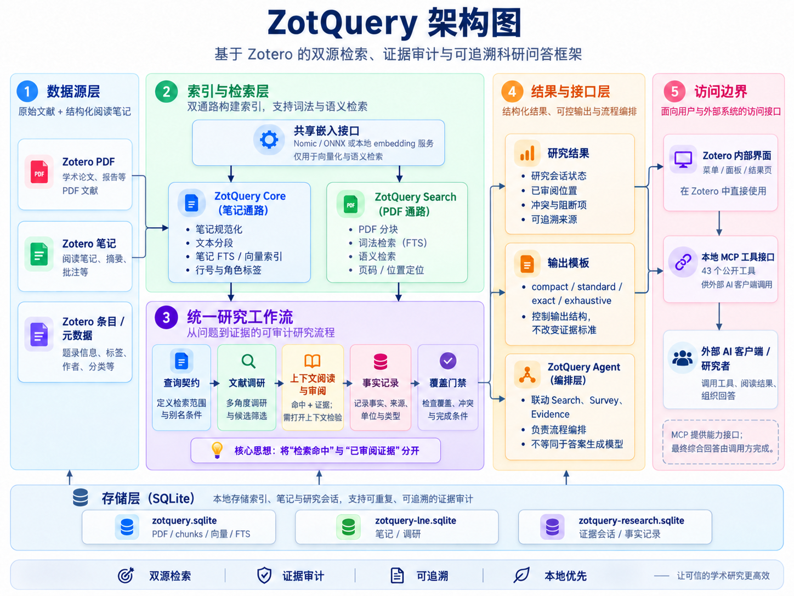

# ZotQuery —— 文献内容检索与审阅输出

适应场景：解决研究者资料库庞大，每次想基于某个问题查询文献都会面临记忆篇目不全和整理工作庞大的这两大问题，直接询问AI又会面临引用数据不全与模型幻觉问题。该插件即可通过详细检索zotero中已有的PDF原文和研究者自身记录的笔记，输出相应条目并搭建完善的上下文阅读、审阅决策与核实要求，迫使 AI agent 给出一个全面、可靠、详实的回答。

[English](README-EN.md) · [下载 3.0.14 XPI](https://github.com/poesein/ZotQuery/releases/tag/v3.0.14) · [架构详解](docs/ARCHITECTURE-3.0-ZH.md) · [问题反馈](https://github.com/poesein/ZotQuery/issues)

ZotQuery 不把“检索命中”直接当成“已证实的答案”。它帮助研究者从 Zotero 文献库与阅读笔记中发现线索，回到可定位的 PDF 文段，记录审阅和事实，再检查本次研究还有哪些证据缺口。插件在 Zotero 内运行，也向外部 AI 客户端提供带认证的本地 MCP 工具。

当前版本为 **3.0.14**，支持 Zotero 10.0.x。一个现有 Zotero 资料已通过安装版本、索引保留、实时向量查询和认证 MCP 搜索检查；全新资料安装、旧 ID 数据迁移和两个在线模型主机间切换仍未完成端到端验收。请先备份资料，再在可回退的环境中试用。

## 为什么使用 ZotQuery？

- **PDF 与笔记互补**：PDF 通路定位论文正文；笔记通路找回已整理的观点、实验线索和行号。笔记帮助导航，不自动升级为原始 PDF 证据。
- **检索范围可说明**：Query Contract 区分必须满足、建议出现、明确排除和调用方声明的别名。覆盖结论始终相对于这份契约与已索引内容，而不是声称“查完全部文献”。
- **审阅过程可追踪**：候选位置、上下文访问、审阅决策、事实值、来源短引和冲突分别保存。能看出哪些内容只是命中，哪些经过审阅，哪些仍未解决。
- **一次调研可以继续**：Survey 保留多角度查询、候选论文、筛选和阅读状态；关闭 Zotero 后仍可继续，而非每次从空白搜索结果重来。
- **PDF 与 Note 共用向量模型**：两条通路共用当前 embedding 接口，但索引和定位信息分别保存。经严格核验为同一 Ollama 模型的地址切换可沿用既有向量；真实换模不会静默混用。
- **适合人与 AI 协作**：Zotero 内可查看状态，外部客户端可调用统一的 `zotquery_*` MCP 工具。输出模板组织研究台账，却不会越过证据门禁替你编造结论。

相较于仅返回相关段落的检索工具，ZotQuery 的重点是把“找到了什么”和“读过并确认了什么”分开。它不宣称比其他插件有更高召回率或更快速度，也不能代替研究者判断论文的实验设计与科学含义。

## 架构一览

图中 Core、Search、Survey、Evidence、Agent 和 MCP 是**同一个 Zotero 插件内的职责模块**，不是六个独立服务或模型。底部三个数据库名对应 3.0.14 使用的 `zotquery.sqlite`、`zotquery-lne.sqlite` 和 `zotquery-research.sqlite`。embedding 服务除本机外也可位于可信私有 IPv4 局域网。详见[架构详解](docs/ARCHITECTURE-3.0-ZH.md)。

| 通路或模块 | 做什么 | 不做什么 |
| --- | --- | --- |
| Search（PDF） | 提取与分块已收录 PDF，建立词法/向量索引，保留可用的页码和位置 | 不保证扫描件、截断页或未索引附件被完整读到 |
| Core（Note） | 规范化笔记、分段、识别配置过的证据角色，提供词法/向量检索及行号 | 不把笔记标签自动证明为原论文结论 |
| Survey 与 Evidence | 组织候选、读取上下文、记录审阅与 FactRecord，并检查覆盖与冲突 | 不把词项共现或相似分数直接当作事实 |
| Agent、输出与 MCP | 编排研究步骤、呈现持久化结果、向外部客户端开放工具 | 不内置一个能够自行完成科研判断的生成式大模型 |

共享的 **embedding 模型只负责把文本变成检索向量**。内置 Nomic/ONNX 路线或配置的 embedding 服务都不是自动撰写答案的聊天模型；使用哪种外部生成模型，由调用 ZotQuery 的客户端自行决定。

## 安装与开始使用
**注：插件件主要承担zotero PDF和notes检索和证据审计与规范功能，输出需要依赖连接 AI agent 整合证据链。**
| 项目 | 要求或默认行为 |
| --- | --- |
| Zotero | 10.0.x；请通过插件管理器安装 XPI |
| 向量模型 | 可使用打包的 Nomic ONNX 模型，或配置可访问的兼容 embedding 服务；不需要 Qwen/生成模型才能索引和检索 |
| PDF 索引 | 默认仅题名与摘要；需要原文证据时应选择完整 PDF 并检查提取与覆盖状态 |
| Note 索引 | 默认 My Library，自动变更同步关闭；可在设置中选择范围和手动同步 |
| 网络 | 本机推理可在本地运行；使用局域网服务时，发送的文本和可能的凭据会经过该网络 |

1. 备份 Zotero 数据目录，从[3.0.14 发布页](https://github.com/poesein/ZotQuery/releases/tag/v3.0.14)下载 XPI，在 Zotero 插件管理器中从文件安装并重启。3.0.14 可升级同一独立扩展 ID 的 3.0.12/3.0.13；使用旧 ZotSeek ID 的早期版本不会原位升级或自动迁移索引。同版本资源更新不会触发自动升级；已安装 3.0.14 的用户如需取得刷新后的包，须手动重装 XPI。
2. 打开 ZotQuery 设置，选择 PDF 范围、Note 范围和一个活动向量模型。先用少量 PDF 与笔记测试。若使用局域网 Ollama，确认 Zotero 所在机器能访问服务；公网主机不受支持。
3. 建立 PDF 索引并同步笔记。检查研究系统状态中的 PDF 覆盖、Note 向量覆盖、共享模型一致性及**查询时服务可用性**；缓存达到 100% 不代表当前服务在线。
4. 从搜索开始探索，或让支持 MCP 的客户端按下方研究流程工作。需要原始证据时，请打开 PDF 上下文，不要只引用搜索摘要或笔记。

普通笔记由 `generic` Note Profile 解析；内置的 `strawberry-vnext` 仅兼容一种精读笔记**格式**，不含个人研究方向。Output Profile 包括 `compact`、`standard`、`exact` 和 `exhaustive-vnext`，只改变呈现，不改变证据标准。详见[配置说明](docs/PROFILES-3.0-ZH.md)。

## 一次可审计研究怎样进行？

1. 用 `zotquery_evidence_plan` 检查问题的 MUST/SHOULD、别名和预估范围；自动规划的硬条件也需要调用方核对。
2. 用 `zotquery_evidence_research_start` 联动 PDF Evidence 与持久化 Survey，或用 `zotquery_evidence_sweep` 建立纯 PDF 覆盖会话。
3. 分页查看 `zotquery_evidence_positions`，对需要审阅的位置调用 `zotquery_evidence_context`，再记录 `zotquery_evidence_review`。笔记线索可继续定位到同一 Zotero 父条目的 PDF。
4. 对精确事实，用已审阅的原始 PDF 文段登记 `zotquery_evidence_fact`，保留值、单位、编号、短引与位置；冲突需要独立来源约束的裁决。
5. 查看 `zotquery_evidence_finalize` 与研究结果。未满足范围、阅读、事实槽或冲突条件时应保持阶段性状态；满足条件表示“可以进入综合”，**不等于自动证明最终答案正确**。

上述步骤通常要循环和分页，不是每个工具各调用一次就算完成。详见[研究协议](docs/RESEARCH-PROTOCOL-ZH.md)与[查询契约](docs/QUERY-CONTRACT-V2-ZH.md)。

## 本地 MCP、数据与隐私

统一 MCP 在 Zotero 本地 API 的 `/zotquery/mcp` 提供 **43 个 `zotquery_*` 工具**，其中部分会修改本地研究状态。客户端必须发送在设置页取得的 `Authorization: Bearer <令牌>`；不要把 Zotero 本地 API 端口通过代理开放到局域网或公网。默认端口通常是 `23119`，以你的 Zotero 设置为准。

PDF 索引、笔记/Survey、证据会话分别保存在上述三个本地 SQLite 文件。公开 XPI 不包含你的文献、笔记、数据库、个人偏好、模型服务地址或密钥。配置局域网 embedding 服务时，片段和查询会发往该服务；使用普通 HTTP 时，文本及可能的凭据在局域网上不加密。外部 AI 客户端是否继续把材料发往云端，取决于客户端配置。**插件本地存储不等于整个研究链路绝对离线。**

## 能力边界与来源

- 覆盖门禁审计的是**明确查询契约下的已索引候选**，不是互联网上全部文献；PDF 截断、OCR 缺失及检索词落在不同分块中都可能造成遗漏。
- DIRECT FactRecord 会检查原始 PDF 位置、已审阅状态和引文中的字面值，但无法自动判断否定语境、实验体系、单位或科学解释是否正确。
- PDF 仅在附件唯一且物理页有效时生成页级链接；Note 保留规范文本行号和短引，链接仍停在笔记条目级。
- Survey 保存调查进度；Agent 负责编排流程；MCP 提供访问工具。这三者都不保证外部模型一定遵守证据流程。

ZotQuery 基于 [ZotSeek](https://github.com/introfini/ZotSeek) 1.21.2 的 PDF 检索与 embedding 运行时改造，新增 Note、Survey、Evidence、输出与统一 MCP。项目采用[根目录 MIT 许可证](LICENSE)，第三方来源与尚待核对的授权细节见[说明](THIRD-PARTY-NOTICE.md)。源码构建与测试见[构建文档](docs/BUILDING.md)；反馈问题请附版本、复现步骤和**脱敏**日志，不要上传 Zotero profile 或数据库。

完整的已验证范围与未完成项目见[发布审计](docs/RELEASE-AUDIT-ZH.md)。
